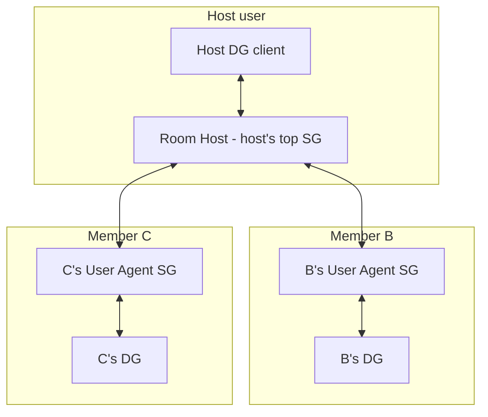
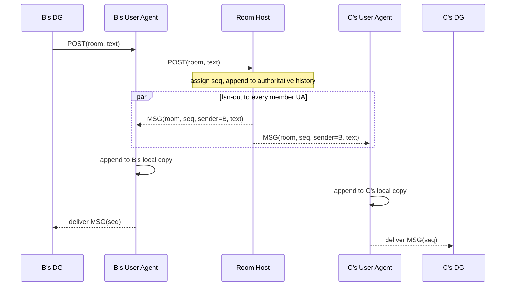

# pNet Chat

A Discord-style app: persistent chat rooms with text history, plus live voice and
screen share. It runs entirely on top of the pNet app API — pNet stays a dumb
pipe whose only job is "get bytes from one device's app to another device's app."
pNet has no concept of a room, a member, or a message. Everything in this document
is implemented inside the app using only the four primitives pNet already gives an
app:

| Op | Name | What the app uses it for |
|---|---|---|
| `0x00` | `app_register` | Announce ourselves on this device; get our per-device `app_id` + `token`. |
| `0x02` | `app_get_data` | Read the tree: our own devices, our contacts, their devices (grade/`sg_rank`), and which of their devices run this app. |
| `0x03` | `app_send_packet` | Send an opaque app payload to a `(device_uuid, app_id)`. |
| `0x04` | `OP_PUSH` | Receive an inbound app payload (with its sender) from pNet. |

The unit `pnet_deliverer` already proves the 1:1 case (register → get-data →
send → push). pNet Chat is the multi-party, history-keeping generalization, with a
reliable central host per room.

## Goals

- Persistent chat rooms with full message history, scrollable even when other
  members are offline.
- Live voice and screen share between room members.
- A trust model that fits pNet: the people in a room do **not** all have to be
  contacts of each other.
- A reliable home for each room that does not depend on a laptop or phone being
  awake.
- Zero changes to pNet core. If a feature needs pNet to understand "rooms," the
  design is wrong.

## The dumb-pipe contract (what pNet does NOT do for us)

We assume nothing beyond message delivery between contacts. In particular pNet
does **not** give us: rooms, groups, broadcast/multicast, ordering across
messages, retransmission of app payloads, persistence of app payloads, or any
guarantee that a sent packet arrives. Every one of those is the app's job. pNet
*does* give us: routing between two devices (subject to the contact rule below),
a per-device view of our contacts and their devices/apps, and best-effort
delivery of one payload to one app.

One more pipe property is load-bearing and was confirmed against the core
(`handlers.rs` `app_send_packet`): **an app payload is a single, unfragmented
UDP datagram.** pNet appends our bytes after a 48-byte header and wraps the
result in one encrypted packet; nothing in the relay or tunnel path splits or
reassembles. After on-wire crypto overhead (24-byte nonce + 16-byte tag) and
relay addressing, the WAN-safe app-body ceiling is ~1 KB (avoiding IP
fragmentation); ~4 KB is the absolute limit set by the apps' receive buffers.
We fix **`MAX_APP_PAYLOAD = 1024` bytes** (envelope included) as the unit every
message must fit in. Anything larger — history replays, attachments, video
frames — is the app's job to chunk (see *Attachments* and the blob family).

A second pipe property shapes the whole permission model: **an inbound push is
stamped only with the sender's `app_id`** (push format `[0x04][sender_app_id:16]
[payload]`), never a device or user. Identity is therefore something the
receiver *resolves*, not something the sender *asserts* — see *Permissions*.

We also assume one deployment fact that the whole design leans on:

> **The app is installed and user-approved on every SG a participating user owns.**

This is what lets a flaky DG (laptop/phone) delegate the reliable work to an
always-on SG. "Installed and approved" is load-bearing — see *Discovery*, because
`app_get_data` only reveals a contact's `user_approved` apps.

## Roles and topology

Two roles, both played by the app running on an SG:

- **User Agent (UA)** — the instance of this app on a user's **top-ranked SG**
  (lowest `sg_rank` among that user's `grade == SG` devices). Every user has at
  most one acting UA. The UA is that user's hub for *every* room they are in: it
  holds that user's copy of room history, talks to peers on that user's behalf,
  and does last-mile delivery to that user's own DGs.
- **Room Host (RH)** — for a given room, the UA of the user who created it. The RH
  is the single authority for that room: it assigns message order, holds the
  authoritative history, and fans messages out to every member's UA. A node is an
  RH for the rooms it owns and an ordinary UA (member) for rooms others own.

DGs are thin clients. A DG never participates in a room directly; it talks only to
its own user's UA.



Note what this buys us: **every packet on the diagram is between two contacts or
between one user's own devices.** B and C may be total strangers; they never
exchange a packet, because all room traffic stars through the RH, and the host is
a contact of both. This is the core idea — the friendship graph only has to be a
star centered on the host, never a full mesh.

## Trust and membership model

- A room is **owned by one user** (the creator) and hosted on that user's RH.
- **The host must be a contact of every member.** This is the only friendship
  constraint, and it falls straight out of the topology: the RH can only route to
  devices of its own contacts.
- **Members need no relationship to one another.** Joining a room is implicit
  consent to be visible (messages, voice, face) to co-members; the host vouches
  for everyone. The member list is shown to all members so there are no surprises.
- **Only the host adds or removes members**, and only from the host's own contact
  list. The RH enforces this (see *Permissions*).
- **Leaving stops the feed; it does not unsend history.** Both a host
  `REMOVE_MEMBER` and a member's voluntary `LEAVE` simply drop the member from the
  list, halt their feed, and emit a `MEMBER_UPDATE` to the rest. A departed member
  keeps the local history their UA already holds — we cannot enforce deletion on
  another user's SG, and pretending to would be security theater (the same trust
  reality as every chat app). An optional per-room `purge_on_leave` flag may
  *ask* a departing UA to drop its copy, honored voluntarily; it is off in v1.

## Discovery and addressing

When the RH needs to reach member B, it resolves B from its own `app_get_data`
snapshot:

1. Find B in `contact_users`.
2. Among B's devices, pick the one with `grade == SG` and the lowest `sg_rank` —
   B's top SG, i.e. B's UA device.
3. On that device, find the app whose **alias matches our well-known alias**
   (`pnet-chat`) and `user_approved == true`. Read back **that device's**
   `app_id`.
4. Address packets to `(B_UA_device_uuid, that_app_id)`.

Two rules make this robust, both forced by how the pNet API actually works:

- **Discover by alias, address by the id you read back.** `app_id` is a fresh
  UUID minted per registration (`handlers.rs` `app_register`), so it is *not* a
  shared constant across installs. The only stable cross-device identifier is the
  alias we choose. We match on alias and use the per-device id we read from the
  snapshot as `dest_app_id`.
- **Discovery is eventually consistent — tolerate staleness.** `app_get_data`
  returns whatever pNet has last synced about a contact's public state, and only
  lists `user_approved` apps. A member who just installed/approved the app, or
  whose SG rank just changed, may not be visible yet. The app must not treat
  "not yet visible" as "not a member." Fallbacks:
  - The RH may send the room invite to **whatever** contact device of the member
    *is* currently visible; the member's app forwards the invite to that user's
    UA internally.
  - Each UA, on coming online, **announces itself** to the RHs of rooms its user
    belongs to (a `HELLO` carrying the UA's `(device_uuid, app_id)`), so the RH
    learns the correct address without waiting on public-state sync.

The invite the RH sends always carries the RH's own `(device_uuid, app_id)` so a
member's UA knows where to send posts back up.

## Posting a message

Every user interacts with a room only through their own UA. A post from any
member therefore takes the same path, and the RH is the single point that assigns
order:



The originator sees their own message only once the RH has ordered it — that
round trip *is* the delivery confirmation and guarantees everyone applies messages
in the same order.

## History and backfill

- The **authoritative** history lives on the RH.
- Each member's **UA keeps that member's own copy** of every message it receives.
  So a member can scroll history even while the host (or anyone else) is offline —
  their own SG already has it.
- A DG holds only a cache; on reconnect it pulls from its own UA.

New member joins: when the host adds B, the RH sends an invite, B's UA announces
itself, and the RH streams the room's history to B's UA. **Default: full history**
(Discord-like); the per-room `join_history_mode` byte can switch this to "from
join point."

Retention is app-defined and host-configured (the RH is the authority). v1 ships
**keep-all** on both the RH and each UA, but the `OPEN_ROOM`/`INVITE` wire format
reserves two bytes now for forward-compatibility: `retention_mode` (0=keep-all,
1=window-by-count, 2=window-by-age) and `join_history_mode` (0=full, 1=from-join).
Each UA manages its own local storage independently; the RH's retention only
bounds what backfill it can still serve.

## Delivery and ordering guarantees

The RH assigns a monotonic `seq` per room. That single sequencer is the entire
consistency model — no CRDTs, no distributed consensus.

- **RH ↔ UA is the reliable leg.** Both ends are always-on SGs. The RH retries a
  `MSG` to a member UA until acked, and each UA tracks its last-applied `seq` per
  room. On reconnect a UA sends `HISTORY_REQ(room, since=cursor)` and the RH
  replays the gap. Application is idempotent by `(room, seq)`.
- **UA → DG is best-effort.** The UA pushes to the user's online DGs; a DG that
  missed messages pulls from its own UA on reconnect. Last-mile loss never costs a
  message because the UA already persisted it.

This is the split that makes the system durable without making the pipe smart: put
the guarantees on the leg between two reliable nodes, and let the flaky leg heal by
pulling.

## Host failover

The RH is reliable but not immortal. Because the app runs on **all** of the host
user's SGs, the RH **mirrors authoritative room state** (membership, history, and
the `seq` counter) to the host user's other SG agents. This is just one user's own
devices syncing their own app state — trivially trusted, same-user routing.

When the host's rank-1 SG drops:

1. The host's rank-2 SG (which holds the mirror) becomes the acting RH.
2. The host user's `sg_rank` change propagates through pNet's normal public-state
   sync, so member UAs eventually re-resolve the host's current top SG via
   `app_get_data`. The new RH can also proactively send `HOST_MOVED` to the
   members it knows.
3. Member UAs re-announce (`HELLO`) to the new RH and resume from their `seq`
   cursor.

If the host has only one SG, the room freezes (read-only from local copies) until
that SG returns — an explicit, acceptable degradation, not a correctness bug.

## Members without an SG

A DG-only user has no SG to act as their UA. For such a member the RH addresses the
member's **DG directly** and keeps a per-member delivery cursor, caching messages
and re-delivering when the DG reconnects. Reliability is lower (a DG can be offline
arbitrarily long and the RH must hold its backlog), but the model still works.
Recommended UX: nudge active users to install the app on an SG.

## Attachments and large payloads

Because every app payload is a single ≤ 1 KB datagram, anything bigger than a
text line is chunked by the app over the **blob family** (`0x30`–`0x33`). This is
one generic mechanism reused for both attachments and oversized history replays —
not a special case per feature, and explicitly **not** the `pnet_deliverer` path
(that is a separate app with separate ids; all chat bytes stay inside pnet_chat).

A chat message references its attachments by `blob_id` only; the sender's UA
ships the bytes to the RH with a `BLOB_OFFER` followed by `BLOB_CHUNK`s, and the
RH re-offers them to each member UA on demand. Transfers run on the reliable
RH↔UA leg with cumulative `BLOB_ACK` / explicit `BLOB_NACK`, reassembled by
`blob_id` and verified against the offered `sha256`. A DG pulls a blob from its
own UA the same way it pulls history.

## Voice and screen share

Live media is a separate, **ephemeral** path. It is never appended to history and
never `seq`-ordered; frames carry their own timestamps and late frames are dropped.

- Media frames ride the same `app_send_packet` primitive as text — pNet just moves
  bytes and never knows it is carrying audio or video.
- The RH acts as a **selective forwarding unit (SFU)**: each speaker/streamer sends
  one media stream up to the RH, which forwards it to the other members.
- **This concentrates bandwidth on the RH.** Text fan-out is nothing; voice is
  modest; screen-share fan-out for a large room is heavy.

**Media routes RH ↔ member DG directly, bypassing the UA.** The UA hop exists
only to give text durability and `seq`-ordering; media has neither (ephemeral,
self-timestamped, late frames dropped), so routing it through a member's UA adds
an SG hop of latency and doubles SG bandwidth for no benefit. The contact rule
already permits RH↔member-DG (the host is a contact of the member). A member's
DG announces a media endpoint with `MEDIA_JOIN` on entering a call; the RH
forwards frames straight to each joined DG and drops the endpoint on
`MEDIA_LEAVE` or presence timeout. Control and history stay on the reliable UA
leg.

**Single-RH SFU, hard-capped.** A relay-tree or peer-assisted path cannot help
here: the contact rule forbids member↔member links, so every alternative still
funnels through host-grade nodes — not worth v1 complexity. The RH enforces
explicit caps (rejecting `MEDIA_JOIN` past them): v1 targets **≤ 8 participants
in a voice call and ≤ 1 concurrent screen-share**. The RH uplink is the
documented scaling wall; simulcast/SVC layers are the later lever, not topology
changes.

## App-level protocol

All payloads below are the opaque bytes carried in the `0x03` / `0x04` body; pNet
does not parse them. Every payload begins with the same envelope:

```
[version:u8 = 1][msg_type:u8][room_id:16][body...]
```

`room_id` is a UUID the RH generates at room creation. An all-zero `room_id` is
the **multi-room sentinel** used by messages that are not scoped to one room
(currently `HELLO`). A receiver drops any payload whose `version` it does not
understand or whose `msg_type` it does not recognize (logging it), so new types
are additive.

**Field conventions.** `uuid` = 16 bytes. `str` = `[len:u8][utf8]` (≤ 255 bytes,
for names/aliases/mime). `text` = `[len:u16][utf8]` (chat bodies, up to the
datagram budget). All multi-byte integers are big-endian. Timestamps are
`u64` milliseconds since the Unix epoch. Every message must fit
`MAX_APP_PAYLOAD = 1024` bytes including the 18-byte envelope; oversized content
goes through the blob family (`0x30`–`0x33`).

### Control and text

| Type | Name | Direction | Body |
|---|---|---|---|
| `0x01` | `OPEN_ROOM` | host DG → own UA | `name:str, retention_mode:u8, join_history_mode:u8, member_count:u8, member_user:16 ×N`. Envelope `room_id = 0`; the UA mints the real id. |
| `0x02` | `ROOM_CREATED` | UA → host DG | *(empty)* — envelope `room_id` is the minted room id. |
| `0x03` | `INVITE` | RH → member (UA or DG) | `name:str, host_user:16, rh_device:16, rh_app_id:16, retention_mode:u8, join_history_mode:u8, member_count:u8, (member_user:16, alias:str)×N`. |
| `0x04` | `HELLO` | member UA → RH | `ua_device:16, ua_app_id:16, room_count:u16, (room_id:16, last_seq:u64)×N`. Envelope `room_id = 0`; one `HELLO` per RH batches that RH's rooms. |
| `0x06` | `ADD_MEMBER` | host DG → RH | `member_user:16` (must be a host contact). |
| `0x07` | `REMOVE_MEMBER` | host DG → RH | `member_user:16`. |
| `0x08` | `LEAVE` | member UA → RH | *(empty)*. |
| `0x09` | `MEMBER_UPDATE` | RH → member UAs | `change:u8 (0=add, 1=remove, 2=leave), member_user:16, alias:str`. |
| `0x0A` | `POST` | member DG → own UA → RH | `client_msg_id:16, text, attach_count:u8, blob_id:16 ×N`. |
| `0x0B` | `MSG` | RH → member UA → DG | `seq:u64, sender_user:16, ts_ms:u64, client_msg_id:16, text, attach_count:u8, (blob_id:16, name:str, mime:str, total_len:u32)×N`. |
| `0x0C` | `ACK` | UA → RH | `seq:u64` — cumulative applied-through; drives RH retry/backlog trim. |
| `0x0D` | `HISTORY_REQ` | UA/DG → RH/own UA | `since_seq:u64, max_count:u16`. |
| `0x0E` | `HISTORY_RESP` | RH/UA → requester | `from_seq:u64, to_seq:u64, more:u8, count:u16, (entry_len:u16, MSG-body)×count`. Self-chunks: while `more`, the requester re-asks with `since = to_seq`. |
| `0x0F` | `HOST_MOVED` | new RH → members | `new_rh_device:16, new_rh_app_id:16`. |

`client_msg_id` is minted by the originating DG so it can correlate its
optimistic local echo with the ordered `MSG` the RH sends back — the round trip
*is* the delivery confirmation. Apply is idempotent by `(room_id, seq)`.

### Intra-user (client ↔ User Agent)

A DG is a thin client of its own user's UA; before any room traffic it announces
itself so the UA knows it is online and where to deliver. Authenticated by
auth-by-stamp (the UA accepts only its *own user's* devices). Envelope
`room_id = 0` (not room-scoped).

| Type | Name | Direction | Body |
|---|---|---|---|
| `0x10` | `CLIENT_ATTACH` | DG → own UA | *(empty)* — sender resolved from the stamp; re-sent on a presence interval. |
| `0x11` | `CLIENT_ATTACH_ACK` | UA → DG | *(empty)* — confirms the UA registered this client. |

### Media (ephemeral, unacked, RH ↔ member DG)

| Type | Name | Direction | Body |
|---|---|---|---|
| `0x20` | `MEDIA_JOIN` | member DG → RH | `media_device:16, media_app_id:16, modes:u8 (bit0 audio, bit1 video/screen)`. |
| `0x21` | `MEDIA_LEAVE` | member DG → RH | *(empty)*. |
| `0x22` | `MEDIA_FRAME` | streamer → RH → members | `stream_id:u32, codec:u8, frame_seq:u16, ts:u32, flags:u8 (bit0 keyframe), payload`. Not persisted, not `seq`-ordered; late frames dropped. |

### Blob family (chunked transfer for attachments and large history)

A `MSG`/`POST` carries only `blob_id` references; the bytes flow separately over
the reliable RH↔UA leg. Reassembly is keyed by `blob_id`, idempotent by
`(blob_id, chunk_index)`. Default `chunk_size` is 1000 bytes (fits the datagram
budget after the envelope and blob header).

| Type | Name | Body |
|---|---|---|
| `0x30` | `BLOB_OFFER` | `blob_id:16, total_len:u32, chunk_size:u16, chunk_count:u32, sha256:32, name:str, mime:str`. |
| `0x31` | `BLOB_CHUNK` | `blob_id:16, chunk_index:u32, bytes`. |
| `0x32` | `BLOB_ACK` | `blob_id:16, next_needed:u32` (cumulative). |
| `0x33` | `BLOB_NACK` | `blob_id:16, missing_count:u16, chunk_index:u32 ×N`. |

## Permissions and authority checks (all at the RH)

The RH is the only node that grants authority. The foundation is the pipe
property noted above: **a push carries only the sender's `app_id`** — no device,
no user. So identity is *resolved*, never *asserted*:

> The RH maintains a reverse map `app_id → (user_uuid, device_uuid)` built from
> its own `app_get_data` snapshot (this is exactly the deliverer's `app_labels`,
> extended to carry user + device). **Every inbound packet is authenticated by
> the pNet-stamped `sender_app_id`, resolved through this map. A payload's own
> claims about who it is are ignored for authentication.** If the stamped
> `app_id` does not resolve, or resolves to a non-member, the packet is dropped.

Two consequences follow and must be honored:

- A member is authenticatable **only once their app is approved and visible in
  the RH's snapshot.** Until public-state sync catches up, the RH cannot verify
  them — it must treat "unresolvable sender" as "wait," not "reject forever"
  (ties to *Discovery is eventually consistent*).
- A `HELLO`'s self-claimed `(device_uuid, app_id)` is a **return-address hint
  only.** The RH trusts the *stamped* id for identity and resolves the reply
  `device_uuid` from its snapshot; it never lets a payload name its own sender.

With identity resolved, the authority rules are:

- **Control messages** (`OPEN_ROOM`, `ADD_MEMBER`, `REMOVE_MEMBER`) are accepted
  only when the resolved sender device is one of the **host user's own devices**
  (resolved `user_uuid` == our owner's user). This is what "only the host manages
  the room" means in code.
- **`ADD_MEMBER` targets** must be in the host's `contact_users`. Reject otherwise
  — you cannot add a stranger.
- **`POST` / `HELLO` / `LEAVE`** are accepted only when the resolved sender's user
  is in the room's current member list. A non-member's packet is dropped.
- A member UA, symmetrically, only accepts `MSG`/`HISTORY_RESP`/`MEMBER_UPDATE`
  for a room from that room's **current RH** address (resolved the same way).

## Resolved design decisions

The original open questions are now settled in the body above; recorded here for
traceability:

- **Media path** → RH ↔ member **DG** directly, bypassing the UA. Media needs
  neither durability nor ordering, and the contact rule already permits it; the
  UA hop would only add latency and SG load. (*Voice and screen share*.)
- **Media at scale** → single-RH SFU with hard caps (≤ 8 voice, ≤ 1
  screen-share). Relay-trees/peer-assist can't satisfy the member↔member
  contact rule, so the lever is codec layering (simulcast/SVC), not topology.
- **History retention** → keep-all by default; host-configured; two reserved
  wire bytes (`retention_mode`, `join_history_mode`) for forward-compat.
- **Leaving a room** → `LEAVE`/`REMOVE_MEMBER` stop the feed only; local copies
  persist (deletion is unenforceable on another user's SG). Optional
  `purge_on_leave` courtesy flag, off in v1.
- **Attachments / large payloads** → generic blob family (`0x30`–`0x33`),
  chunked over the ≤ 1 KB datagram, reused for history replay; not the
  `pnet_deliverer` path.
- **Multiple rooms, one UA** → confirmed; `room_id` scopes all UA state and
  every envelope. `HELLO` batches a UA's rooms per RH in one datagram.

## Remaining open questions

- **Presence / typing indicators**: worth a lightweight ephemeral channel
  (like media, unordered) or out of scope for v1?
- ~~**DG-direct media NAT**: confirm the RH can reach a member's DG directly.~~
  **Resolved against the core.** A member's DG already opens connections to every
  contact's SG of every rank (`maintain_connections`), and `keepalive_dg`
  (post-7c.15) warms the NAT mapping on *each* every 20s — so the RH, being a
  contact's SG, always has a live mapping to the member DG and reaches it via the
  direct-path branch of `app_send_packet`. Host failover inherits a warm mapping
  too (the DG warms the rank-2 SG as well). The only residual gap is the same
  eventual-consistency one as discovery: a host SG the member's snapshot has not
  yet synced has no connection until sync catches up. No pNet-core change needed.
- **Blob backpressure**: a slow member UA pulling a large history shouldn't stall
  the RH's text fan-out — confirm blob transfers and `MSG` fan-out interleave
  fairly on one RH.

## Implementation phasing

| Phase | Scope |
|---|---|
| 1 | App skeleton: register (`pnet-chat` alias), get-data, send, push. Reuse the `pnet_deliverer` client scaffolding. |
| 2 | Role selection (`UserAgent`/`SgStandby`/`DataGuest`) from the get-data tree + the `app_id → owner` reverse map; a DG resolves its UA (own top-ranked SG) and delegates via the `CLIENT_ATTACH`/`CLIENT_ATTACH_ACK` handshake (UA tracks attached clients, auth-by-stamp own-user check). |
| 3 | Room lifecycle on the RH: `OPEN_ROOM`/`ROOM_CREATED`, membership (`ADD`/`REMOVE`/`LEAVE`/`MEMBER_UPDATE`), `INVITE`, `HELLO`, and the `app_id → (user, device)` reverse map for auth-by-stamp permission checks. |
| 4 | Text messaging: `POST` → RH `seq` assignment → `MSG` fan-out; `client_msg_id` echo correlation; per-UA local history; idempotent apply by `(room, seq)`. ✓ |
| 5 | Reliability: cumulative `ACK` + RH retry, `HISTORY_REQ`/`HISTORY_RESP` (self-chunking), reconnect cursor (HELLO carries last contiguous seq → RH replays the gap), idempotent apply by `(room, seq)`. ✓ |
| 6 | Backfill on join; new-member history streaming. Blob family (`0x30`–`0x33`) for attachments and oversized replays. |
| 7 | Host failover: mirror room state across the host user's SGs; `HOST_MOVED`; member re-resolution. |
| 8 | Voice: `MEDIA_FRAME` path through the RH SFU; small-room target. |
| 9 | Screen share on the same media path; measure the RH hotspot; decide on direct-to-DG media. |

Phases 1–6 deliver a working, durable group chat with history. 7 makes it
resilient. 8–9 add live media.
